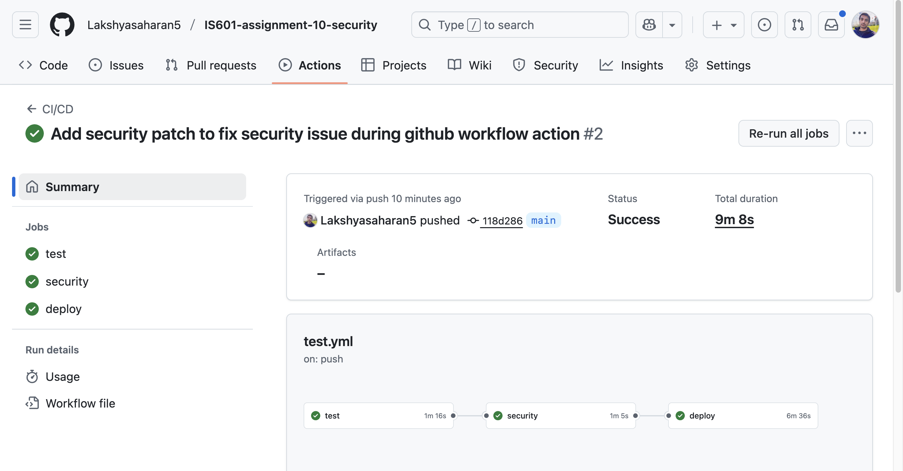
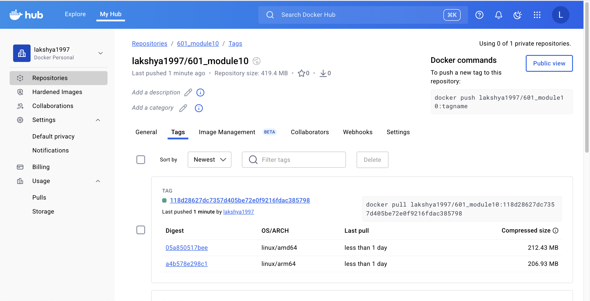

# IS601-assignment-10-security

User authentication model using SQLAlchemy. Containerzed whole application using docker and configured Github CI/CD pipeline for deployment.

## Github Action Workflow




## Docker Hub Deployment

### Docker hub URL: <a href"https://hub.docker.com/r/lakshya1997/601_module10/tags">https://hub.docker.com/r/lakshya1997/601_module10/tags</a>




## Running Test cases on local

Make sure to create `pytest.ini` file to provide test directory path for the `pytest` and other configurations

```bash
# To run integration tests
$ pytest tests/integration/

# To run E2E tests
$ pytest tests/e2e/

# To run unit tests for the operations
$ pytest tests/unit/

# To run all tests including confest
$ pytest

```

## Challenges

#### Security patch issue

Security action workflow fails when running Tivy vulnerability scanner. 
To fix this, I added .tiryignore files with following Vulnerabilities:

- CVE-2025-43859
- CVE-2024-33663
- CVE-2025-62727

#### Docker compose issue

Volume path for postgres inside the container had `data/` which causes issue in newer versions. So removing it solves the issue because postgresql automatically creates subdirectories as needed.

#### E2E test sometime fails

When we run `pytest` then E2E tests sometimes fails in the first run for no reason but successfully runs for the second time.
